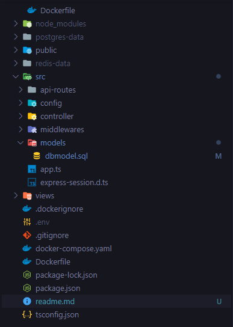
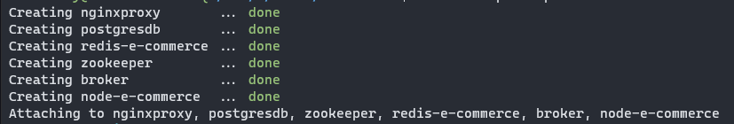
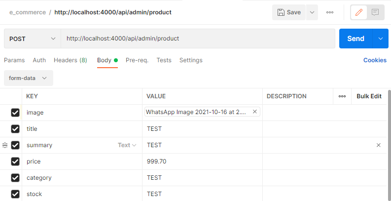
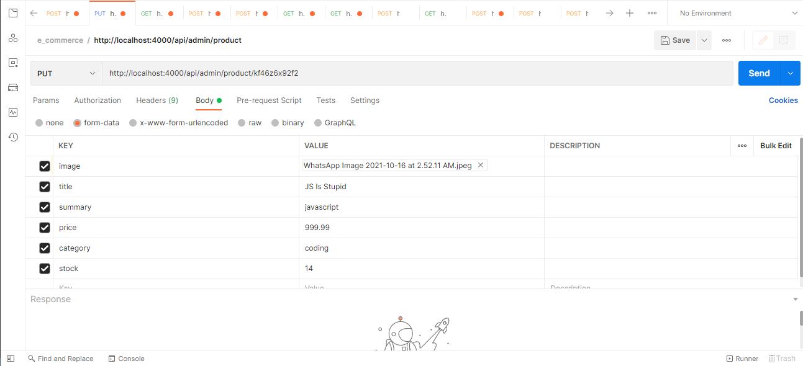

## Introduction

<p>E-commerce API made with typescript, express ,PostgreSQL,Redis & Kafka with all the basic features and more !!</p>

### Technologies

- Nodejs
- Expressjs
- Typescript
- PostgreSQL
- Redis
- Kafka

&nbsp;

## File Structure



## Basic commands

```bash
git clone https://github.com/leoantony72/E-commerce-Api
```

&nbsp;

# Environment Variables

&nbsp;

```ENV
PORT = 4000
DB_USER = PGUSER
DB_PASSWORD = PGPASSWORD
DB_HOST = postgresdb
DB_PORT = 5432
DB_DATABASE = e_commerce
SESSION_SECRET = Session Secret
SESSION_MAXAGE = 3600000 * 60 * 10
GMAIL_USER = email // eg(test123)
GMAIL_PASS = Gmail password
STRIPE_PUBLIC_KEY = Stripe public Key
STRIPE_SECRET_KEY = Stripe Private Key
```

&nbsp;

# Docker build

```bash
docker-compose up // in the root dir
```

&nbsp;



&nbsp;

## Setup Postgres,Redis & Kafka

&nbsp;

```pg
docker exec -it postgresdb psql -U username -W e_commerce
```

⭕Copy and Paste DB Model

```db
CREATE TABLE users(
    userid VARCHAR(11) NOT NULL PRIMARY KEY,
    username VARCHAR(255) NOT NULL UNIQUE,
    email VARCHAR(255) NOT NULL UNIQUE,
    user_role VARCHAR(25) DEFAULT 'USER' NOT NULL,
    passwordhash TEXT NOT NULL,
    registered_at TIMESTAMP NOT NULL,
    user_ip VARCHAR(50),
    active BOOLEAN DEFAULT FALSE NOT NULL,
    token TEXT UNIQUE,
    expiry TEXT
);

CREATE INDEX idx_userid ON users(userid);

CREATE TABLE user_address(
    id VARCHAR(11) NOT NULL PRIMARY KEY,
    userid VARCHAR(11) NOT NULL  REFERENCES users(userid) ON DELETE CASCADE ON UPDATE CASCADE,
    address_line1 VARCHAR(255),
    address_line2 VARCHAR(255),
    city VARCHAR(255),
    postal_code VARCHAR(45),
    country VARCHAR(100),
    telephone VARCHAR(50),
    mobile VARCHAR(50)
);

CREATE INDEX idx_user_add_id ON user_address(userid);

CREATE TABLE user_payment(
    id VARCHAR(11) NOT NULL PRIMARY KEY,
    userid VARCHAR(11) NOT NULL REFERENCES users(userid)
    ON DELETE CASCADE
    ON UPDATE CASCADE,
    payment_type VARCHAR(50) NOT NULL
);
CREATE INDEX idx_user_pay_id ON user_payment(userid);

/*product DB Design*/

CREATE TABLE products(
    pid VARCHAR(11) NOT NULL PRIMARY KEY,
    title VARCHAR(280) NOT NULL,
    image VARCHAR NOT NULL,
    created_at TIMESTAMP NOT NULL,
    summary VARCHAR(325) NOT NULL,
    price DECIMAL(12,2) NOT NULL
);
CREATE INDEX idx_pid ON products(pid);

CREATE TABLE inventory(
    id VARCHAR(11) NOT NULL PRIMARY KEY REFERENCES products(pid) ON DELETE CASCADE ON UPDATE CASCADE,
    quantity INT
);
CREATE INDEX idx_inv_id ON inventory(id);

CREATE TABLE product_category(
    id VARCHAR(11) NOT NULL PRIMARY KEY REFERENCES products(pid) ON DELETE CASCADE ON UPDATE CASCADE,
    name VARCHAR(40) NOT NULL
);
CREATE INDEX idx_cat_id ON product_category(id);

CREATE TABLE discount(
    id VARCHAR(11) NOT NULL PRIMARY KEY REFERENCES products(pid) ON DELETE CASCADE ON UPDATE CASCADE,
    coupon VARCHAR(100) NOT NULL,
    description VARCHAR(300),
    discount_percent DECIMAL(12,2),
    active BOOLEAN DEFAULT FALSE NOT NULL,
    created_at TIMESTAMP NOT NULL
);
CREATE INDEX idx_dis_id ON discount(id);

CREATE TABLE product_rating(
    pratingid VARCHAR(11) NOT NULL PRIMARY KEY,
    userid VARCHAR(11) NOT NULL REFERENCES users(userid)
    ON DELETE CASCADE
    ON UPDATE CASCADE,
    pid VARCHAR(11) NOT NULL REFERENCES products(pid)
    ON DELETE CASCADE
    ON UPDATE CASCADE,
    rating INT NOT NULL,
    date_created TIMESTAMP NOT NULL
);
CREATE INDEX idx_pr_id ON product_rating(pid);


CREATE TABLE ratings(
    rid VARCHAR(12) NOT NULL PRIMARY KEY,
    pid VARCHAR(11) REFERENCES products(pid),
    userid VARCHAR(11) REFERENCES users(userid),
    rating_number INT NOT NULL,
    comment VARCHAR(300) NOT NULL,
    submitted TIMESTAMP NOT NULL
);

CREATE TABLE tokens(
    userid VARCHAR(11) NOT NULL REFERENCES users(userid)
    ON DELETE CASCADE
    ON UPDATE CASCADE,
    token TEXT NOT NULL UNIQUE,
    expiry TEXT
);

CREATE TABLE cart(
    cart_id VARCHAR(13) NOT NULL PRIMARY KEY,
    userid VARCHAR(11) NOT NULL REFERENCES users(userid)
    ON DELETE CASCADE
    ON UPDATE CASCADE,
    pid VARCHAR(11) NOT NULL REFERENCES products(pid)
    ON DELETE CASCADE
    ON UPDATE CASCADE,
    quantity SMALLINT NOT NULL DEFAULT 1,
    date_created TIMESTAMP NOT NULL
);

CREATE INDEX cart_user_id ON cart(userid);

CREATE TABLE orders(
    order_id TEXT PRIMARY KEY NOT NULL,
    customer_id VARCHAR(11) NOT NULL REFERENCES users(userid),
    total DECIMAL(12,2) NOT NULL,
    billing_address_id VARCHAR(11) NOT NULL,
    order_status VARCHAR(100),
    payment_type VARCHAR(40) NOT NULL,
    date_created TIMESTAMP NOT NULL
);

CREATE INDEX orderidx_id ON orders(order_id);
CREATE INDEX order_cust_id ON orders(customer_id);

CREATE TABLE order_items(
    order_item_id VARCHAR(12) PRIMARY KEY,
    order_id TEXT NOT NULL REFERENCES orders(order_id)
    ON DELETE CASCADE
    ON UPDATE CASCADE,
    item_id VARCHAR(11) NOT NULL REFERENCES products(pid)
    ON DELETE CASCADE
    ON UPDATE CASCADE,
    item_quantity numeric NOT NULL
);

CREATE INDEX orderidx_item_id ON order_items(order_item_id);
CREATE INDEX ordItemidx_id ON order_items(item_id);

```

⭕Exit the PG cli

&nbsp;

⭕Redis Setup

```Redis
docker exec -it redis-e-commerce bash -c redis-cli
```

⭕Redis Bloom Filter

```Bloom Filter
BF.RESERVE usernames 0.00001 10000
```

⭕Exit Redis Cli

&nbsp;

⭕Kafka Setup

```kafka
docker exec -it broker bash
```

```create topic
kafka-topics --create --bootstrap-server localhost:9092 --replication-factor 1  --partitions 1  --topic orders
```

# API-ROUTES

&nbsp;

⭕ YOU CAN ACCESS THE SERVER IN localhost:4000 or localhost:80 (NGINX PROXY)

```Base URL
http://localhost
```

&nbsp;

|            Routes             | Method |          Description          |
| :---------------------------: | :----: | :---------------------------: |
|          /api/store           |  GET   |       Access the Store        |
|      /api/auth/register       |  POST  |        Register a User        |
|        /api/auth/login        |  POST  |         Login A user          |
|       /api/auth/logout        |  POST  |         Logout A User         |
|   /api/auth/forgotpassword    |  POST  |    Req For Password Reset     |
|   /api/auth/reset-password/   |  POST  |      Resets The Password      |
|          /api/verify          |  GET   |       Verify The Email        |
|      /api/admin/product       |  POST  |       Insert A Product        |
|    /api/admin/product/:id     |  PUT   |        Update Product         |
|    /api/admin/product/:id     | DELETE |       Delete A Product        |
|     /api/admin/stock/:id      |  PUT   |         Update Stock          |
|   /api/admin/discount/:pid    |  GET   |   Get Discount of a Product   |
|  /api/admin/add_discount/:id  |  POST  |   Add Discount to a product   |
|    /api/admin/activate/:id    |  GET   |       Activate Discount       |
|      /api/manager/orders      |  GET   |          Gets Order           |
|  /api/manager/order/:orderid  |  GET   | Get Individual Order Detailes |
| /api/shipper/updateorder/:oid |  POST  |  Sents Confirm Order Request  |
|  /api/order/confirmdelivery   |  POST  |    User Confirms Delivery     |
|         /api/products         |  GET   |         Get Products          |
|      /api/products/:pid       |  GET   |    Get Individual product     |
|      /api/checkusername       |  POST  |  Checks If Username is Taken  |
|       /api/ratings/:pid       |  GET   |          Get Rating           |
|       /api/ratings/:pid       |  POST  |     Add Rating To Product     |
|       /api/ratings/:pid       |  PUT   |         Update Rating         |
|       /api/ratings/:pid       | DELETE |         Delete Rating         |
|           /api/cart           |  GET   |        Get Cart Items         |
|       /api/addItem/:pid       |  POST  |       Add Item To Cart        |
|     /api/removeItem/:pid      | DELETE |       DEL Item In Cart        |
|         /api/purchase         |  POST  |         Purachse Item         |
|       /api/userAddress        |  POST  |       Add User Address        |
|       /api/userAddress        | DELETE |       DEL User Address        |
|       /api/userAddress        |  PUT   |      Update User Address      |

&nbsp;

```
Lot Of The Endpoints are GET or POST Where They Just Have To Provided With /:id or /:oid etc.. ,So If You Provide It With The Required Params It Wil Work ...
```

# Request Payload

&nbsp;

### ⭕ <B>/api/auth/register</B>

```JSON
{
    "username": "USERNAME",
    "email":"EMAIL",
    "password":"PASS",
    "confirmPassword":"PASS"
}
```

&nbsp;

### ⭕ <B>/api/auth/login</B>

```JSON
{
    "username": "USERNAME",
    "password":"PASS",
}
```

&nbsp;

### ⭕ <B>/api/auth/logout</B>

```JSON
Login In
```

&nbsp;

### ⭕ <B>/api/auth/forgotpassword</B>

```JSON
{
    "email":"EMAIL"
}
```

&nbsp;

### ⭕ <B>/api/auth/reset-password/?rec=</B>

```JSON
{
    "password": "PASS",
    "confirmPassword": "PASS"
}
```

&nbsp;

### ⭕ <B>/api/verify/?vif=</B>

```JSON
Provide the verification token
```

&nbsp;

### ⭕ <B>/api/admin/product</B>

&nbsp;

❗ <B>METHOD: POST</B>

&nbsp;

❗ FORM DATA



<b>👉The tool used here is Postman, Used to test API endpoints...<b><br>
&nbsp;

<b>❗The keys in the Image are the data we should provide to make a POST req, Missing any of the keys will result in an error<b>

&nbsp;

### ⭕ <B>/api/admin/product/:id</B>

&nbsp;

❗ <B>METHOD: PUT</B>

&nbsp;

❗ FORM DATA


<b>👉 The tool used here is Postman, Used to test API endpoints...<b><br>
&nbsp;

<b>❗ The keys in the image are same as that of POST req but make sure to change POST to PUT req.<b> <br>

<b>❗ The keys in the Image are the data we should provide to make a POST req, Missing any of the keys will result in an error<b>

&nbsp;

### ⭕ <B>/api/admin/product/:id</B>

&nbsp;

❗ <B>METHOD: DELETE</B>

```
Administrative Privileges
```

&nbsp;

### ⭕ <B>/api/admin/stock/:id</B>

&nbsp;

❗ <B>METHOD: PUT</B>

```
{
    "stock":"140"
}
```

&nbsp;

### ⭕ <B>/api/admin/add_discount/:id</B>

&nbsp;

❗ <B>METHOD: POST</B>

```
{
    "discount": "20.00",
    "description": "bruh"
}
```

&nbsp;

### ⭕ <B>/api/admin/activate/:id</B>

&nbsp;

❗ <B>METHOD: PUT</B>

```
Activates Discount if you have Admin role
```

&nbsp;

### ⭕ <B>/api/manager/orders?</B>

&nbsp;

❗ <B>METHOD: GET</B>

```
http://localhost:80/api/manager/orders?status=succeeded

http://localhost:80/api/manager/orders?status=fulfilled

```

&nbsp;

### ⭕ <B>/api/shipper/updateorder/:oid</B>

&nbsp;

❗ <B>METHOD: GET</B>

```
Provide Order ID

```

&nbsp;

### ⭕ <B>/api/order/confirmdelivery?uid=&token=&oid=</B>

&nbsp;

❗ <B>METHOD: GET</B>

```
Provide userid,token&orderid

```

&nbsp;

### ⭕ <B>/api/checkusername</B>

&nbsp;

❗ <B>METHOD: POST</B>

```
{
    "username": "USERNAME"
}
```

&nbsp;

### ⭕ <B>/api/ratings/:pid</B>

&nbsp;

❗ <B>METHOD: POST</B>

```
{
    "rating": 4,
    "comment": "Awesome Product"
}
```

&nbsp;

### ⭕ <B>/api/ratings/:pid</B>

&nbsp;

❗ <B>METHOD: PUT </B>

```
{
    "rating": 4,
    "comment": "Awesome Product"
}
```

&nbsp;

### ⭕ <B>/api/purchase</B>

&nbsp;

❗ <B>METHOD: POST </B>

```
{
    stripeTokenId: token.id,
    items: [items],
}
```

&nbsp;

### ⭕ <B>/api/userAddress</B>

&nbsp;

❗ <B>METHOD: POST </B>

```
{
    "address_line1": "ADDR",
    "address_line2":"ADDR2",
    "city":"test",
    "postalCode":"1245678",
    "country":"test",
    "mobile":"test"
}
```

&nbsp;

### ⭕ <B>/api/userAddress</B>

&nbsp;

❗ <B>METHOD: PUT </B>

```
{
    "address_line1": "ADDR",
    "address_line2":"ADDR2",
    "city":"test",
    "postalCode":"1245678",
    "country":"test",
    "mobile":"test"
}
```

&nbsp;

### ⭕ <B>/api/userAddress</B>

&nbsp;

❗ <B>METHOD: DELETE </B>

```
Deletes Automatically when requested
```

&nbsp;

⭕ NOTE

```
You should also setup Order-service (Documentation provided 🔥)
https://github.com/leoantony72/order-service
```
